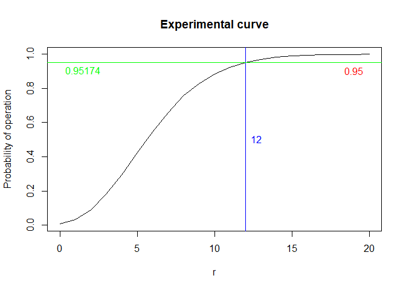
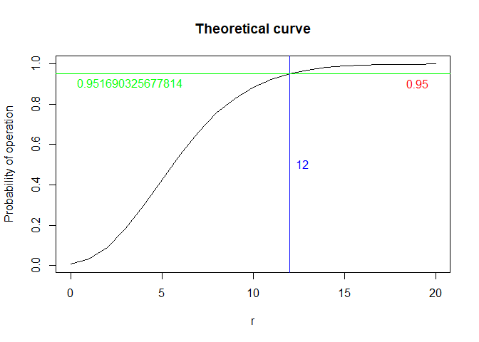

**Analysis and simulation of a renewal process in reliability theory**
================
Raul Almuzara

 

This is the code for the simulation of an electronic system with
components whose lifespans follow an exponential distribution.

 

An electronic system requires $m$ components to operate. These
components are identical and operate independently. The lifespan of each
component follows an exponential distribution of mean $1/\lambda$. The
system is operational only if there are at least $m$ components
operating simultaneously. When the system is not operational, the
components that have not failed continue to function. We increase the
system availability by placing redundant units and by periodic
maintenance. We place $r$ redundant components in addition to the $m$
needed. Through periodic maintenance, the system is inspected every $T$
units of time. At each inspection time, non-operational components are
replaced with new ones. The time it takes a technician to replace a
component is negligible. Defective units can only be detected in these
inspection times. For each working component, there is an operating cost
$I$ per unit of time. There is also a fixed cost $K$ for each inspection
and a repair cost $R$ for each component that must be replaced.

We will find:

1.  The probability that the system will fail between two consecutive
    inspection periods.

2.  The number $r$ of redundant units that would guarantee a probability
    that the system is operational $p_0$.

3.  The asymptotic cost per unit of time of the system.

4.  The asymptotic proportion of time that the system is operational.

For each question, a simulation is presented and we compare the result
with the theoretical calculation in the attached PDF document. In all
cases, we observe a clear agreement between experimental and theoretical
results. All cells can be run to check the results or modify the value
of the parameters. Seeds have been set to ensure reproducibility.

 

------------------------------------------------------------------------

## 1. The probability that the system will fail between two consecutive inspection periods

For this question, we set in the following cell:

- The minimum number of operational components that the system needs to
  function ($m$)

- The number of redundant components ($r$)

- The failure rate for the components, which is the parameter of the
  exponential distribution for their lifespans ($\lambda$)

- The time between two consecutive inspections ($T$)

``` r
m <- 10
r <- 12
lambda <- 0.25
T <- 2
```

We run $1000000$ simulations. In each simulation, we generate $m+r$
times from an exponential distribution. We check how many of them imply
that a component has survived a period between inspections. If less than
$m$ have survived, the system has failed. The probability of failure is
the proportion of simulations in which the system has failed.

``` r
set.seed(42)

simulations <- 1000000
failed_simulations <- 0

for (i in 1:simulations)
{
  exponential_times <- rexp(m+r,lambda)
  survival <- exponential_times >= T
  
  if (sum(survival) < m)
  {
    failed_simulations <- failed_simulations + 1
  }
}

probability_failure <- failed_simulations/simulations

probability_failure
```

    ## [1] 0.048522

We compare this empirical probability with the theoretical probability
of failure that we obtain with the following expression:

$$\sum_{k=0}^{m-1}\binom{m+r}{k}\left(\text{e}^{-\lambda T}\right)^k\left(1-\text{e}^{-\lambda T}\right)^{m+r-k}$$

``` r
sum_value <- 0

for (k in 0:(m-1))
{
  sum_value <- sum_value + choose(m+r,k)*(exp(-lambda*T))^k*(1-exp(-lambda*T))^(m+r-k)
}

sum_value
```

    ## [1] 0.04830967

The experimental probability and the theoretical probability are very
similar.

------------------------------------------------------------------------

## 2. The number $r$ of redundant units that would guarantee a probability that the system is operational $p_0$

For this question, we set in the following cell:

- The minimum number of operational components that the system needs to
  function ($m$)

- The maximum number of redundant components that we will analyze
  ($r_{max}$)

- The failure rate for the components, which is the parameter of the
  exponential distribution for their lifespans ($\lambda$)

- The time between two consecutive inspections ($T$)

- The required minimum probability that the system is operational
  ($p_0$)

``` r
m <- 10
r_max <- 20
lambda <- 0.25
T <- 2
p0 <- 0.95
```

Essentially, the procedure is similar to the previous section. The
difference is that now we are interested in the probability of operation
(complementary to the probability of failure) and we perform $100000$
simulations for each integer value of $r$ in the interval $[0,r_{max}]$.

``` r
set.seed(42)

simulations <- 100000
probabilities_system_operational <- c()

for (r in 0:r_max)
{
  failed_simulations <- 0
  for (i in 1:simulations)
  {
    exponential_times <- rexp(m+r,lambda)
    survival <- exponential_times >= T
    
    if (sum(survival) < m)
    {
      failed_simulations <- failed_simulations + 1
    }
  }
  probability_system_operational <- 1-(failed_simulations/simulations)
  probabilities_system_operational <- c(probabilities_system_operational,probability_system_operational)
}

probabilities_system_operational
```

    ##  [1] 0.00697 0.03340 0.08994 0.18219 0.29589 0.42649 0.54656 0.65962 0.75573
    ## [10] 0.82898 0.88541 0.92329 0.95174 0.96906 0.98174 0.98940 0.99345 0.99627
    ## [19] 0.99777 0.99868 0.99938

``` r
if(any(probabilities_system_operational >= p0) == FALSE)
{
  print(paste('WARNING: None of the probabilities exceeds the threshold p0 =',p0))
  print('Please enter a higher value for r_max and rerun the simulation')
}
```

We plot the curve of probabilities of operation of the system for each
value of $r$. The desired value of $r$ is the minimum such that the
probability of operation is greater than the threshold $p_0$.

``` r
if(any(probabilities_system_operational >= p0) == FALSE)
{
  print(paste('WARNING: None of the probabilities exceeds the threshold p0 =',p0))
  print('Please enter a higher value for r_max and rerun the simulation')
} else
{
  print(paste('The first value of r associated with a probability of operation exceeding the threshold p0 =',p0,'is r =',min(which(probabilities_system_operational>p0))-1))
  
  plot(0:r_max,probabilities_system_operational,type='l',main="Experimental curve",xlab="r",ylab="Probability of operation")

  abline(h=p0, col="red")
  text(x=r_max,y=p0-0.05,as.character(p0),pos=2,col="red")

  abline(v=min(which(probabilities_system_operational>p0))-1,col="blue")
  text(x=min(which(probabilities_system_operational>p0))-1,y=0.5,as.character(min(which(probabilities_system_operational>p0))-1),pos=4,col="blue")

  abline(h=probabilities_system_operational[min(which(probabilities_system_operational>p0))], col="green")
  text(x=0,y=probabilities_system_operational[min(which(probabilities_system_operational>p0))]-0.05,as.character(probabilities_system_operational[min(which(probabilities_system_operational>p0))]),pos=4,col="green")
}
```

    ## [1] "The first value of r associated with a probability of operation exceeding the threshold p0 = 0.95 is r = 12"

<!-- -->

In blue, the minimum value of $r$ that satisfies the minimum required
probability of operation. In red, the value of that minimum probability.
In green, the first probability that exceeds the minimum probability
$p_0$.

The theoretical form of the above curve can be obtained by calculating
the complementary of the theoretical probability of failure:

$$1-\sum_{k=0}^{m-1}\binom{m+r}{k}\left(\text{e}^{-\lambda T}\right)^k\left(1-\text{e}^{-\lambda T}\right)^{m+r-k}$$

``` r
theoretical_probabilities_system_operational <- c()

for (r in 0:r_max)
{
    sum_value_2 <- 0
  
    for (k in 0:(m-1))
    {
      sum_value_2 <- sum_value_2 + choose(m+r,k)*(exp(-lambda*T))^k*(1-exp(-lambda*T))^(m+r-k)
    }
  
    theoretical_probabilities_system_operational <- c(theoretical_probabilities_system_operational,1-sum_value_2)
}

theoretical_probabilities_system_operational
```

    ##  [1] 0.006737947 0.033249703 0.090623299 0.180922304 0.296394445 0.423611738
    ##  [7] 0.548751999 0.661297955 0.755400144 0.829452796 0.884813948 0.924419250
    ## [13] 0.951690326 0.969849349 0.981587595 0.988977419 0.993520652 0.996254663
    ## [19] 0.997868287 0.998803947 0.999337769

``` r
if(any(theoretical_probabilities_system_operational >= p0) == FALSE)
{
  print(paste('WARNING: None of the probabilities exceeds the threshold p0 =',p0))
  print('Please enter a higher value for r_max and rerun the simulation')
}
```

``` r
if(any(theoretical_probabilities_system_operational >= p0) == FALSE)
{
  print(paste('WARNING: None of the probabilities exceeds the threshold p0 =',p0))
  print('Please enter a higher value for r_max and rerun the simulation')
} else
{
  print(paste('The first value of r associated with a probability of operation exceeding the threshold p0 =',p0,'is r =',min(which(theoretical_probabilities_system_operational>p0))-1))
  
  plot(0:r_max,theoretical_probabilities_system_operational,type='l',main="Theoretical curve",xlab="r",ylab="Probability of operation")

  abline(h=p0, col="red")
  text(x=r_max,y=p0-0.05,as.character(p0),pos=2,col="red")

  abline(v=min(which(theoretical_probabilities_system_operational>p0))-1,col="blue")
  text(x=min(which(theoretical_probabilities_system_operational>p0))-1,y=0.5,as.character(min(which(theoretical_probabilities_system_operational>p0))-1),pos=4,col="blue")

  abline(h=theoretical_probabilities_system_operational[min(which(theoretical_probabilities_system_operational>p0))], col="green")
  text(x=0,y=theoretical_probabilities_system_operational[min(which(theoretical_probabilities_system_operational>p0))]-0.05,as.character(theoretical_probabilities_system_operational[min(which(theoretical_probabilities_system_operational>p0))]),pos=4,col="green")
}
```

    ## [1] "The first value of r associated with a probability of operation exceeding the threshold p0 = 0.95 is r = 12"

<!-- -->

The experimental curve and the theoretical curve are almost coincident,
as well as the smallest value of $r$ that satisfies the condition.

------------------------------------------------------------------------

## 3. The asymptotic cost per unit of time of the system.

For this question, we set in the following cell:

- The minimum number of operational components that the system needs to
  function ($m$)

- The number of redundant components ($r$)

- The failure rate for the components, which is the parameter of the
  exponential distribution for their lifespans ($\lambda$)

- The time between two consecutive inspections ($T$)

- A large number of inspection periods ($n$)

- The operating cost per unit of time of each working component ($I$)

- The inspection cost ($K$)

- The repair cost for each component that fails ($R$)

``` r
m <- 10
r <- 12
lambda <- 0.25
T <- 2
n <- 1000
I <- 1
K <- 2
R <- 3
```

We are going to consider $n$ periods of length $T$, i.e., we are going
to study the system up to $t=nT$. For each simulation, the asymptotic
cost per unit of time is calculated. We run $1000$ simulations to
calculate the cumulative cost in the interval $[0,nT]$. The value
proposed at the end is the average of all simulations.

``` r
set.seed(42)

simulations <- 1000
costs <- c()

for (i in 1:simulations)
{
  accumulated_cost <- 0
  for (period in 1:n)
  {
    life_times <- pmin(rexp(m+r,lambda),T)
    operating_cost <- I*sum(life_times)
    inspection_cost <- K
    repair_cost <- R*sum(life_times < T)
    accumulated_cost <- accumulated_cost + operating_cost + inspection_cost + repair_cost
  }
  costs <- c(costs,accumulated_cost)
}

costs_perunittime <- costs/(n*T)
mean(costs_perunittime)
```

    ## [1] 31.29794

The theoretical asymptotic cost per unit of time is

$$\frac{\left(\frac{I}{\lambda}+R\right)(m+r)\left(1-\text{e}^{-\lambda T}\right) + K}{T}$$

``` r
((I/lambda + R)*(m+r)*(1-exp(-lambda*T))+K)/(T)
```

    ## [1] 31.29714

The resemblance between the experimental value and the theoretical value
is clear.

------------------------------------------------------------------------

## 4. The asymptotic proportion of time that the system is operational

For this question, we set in the following cell:

- The minimum number of operational components that the system needs to
  function ($m$)

- The number of redundant components ($r$)

- The failure rate for the components, which is the parameter of the
  exponential distribution for their lifespans ($\lambda$)

- The time between two consecutive inspections ($T$)

- A large number of inspection periods ($n$)

``` r
m <- 3
r <- 2
lambda <- 0.25
T <- 2
n <- 1000
```

We will consider $n$ periods of length $T$, i.e., we will study the
system up to $t=nT$. For each simulation, we calculate the time that the
system is operational in the long run. We run 1000 simulations of the
time that the system is operational in the interval \[0,nT\] and obtain
the proportion with respect to the total time. The value proposed at the
end is the average of all the simulations.

``` r
set.seed(42)

simulations <- 1000
times <- c()

for (i in 1:simulations)
{
  time_system_active <- 0
  for (periodo in 1:n)
  {
    life_times <- pmin(rexp(m+r,lambda),T)
    ordered_life_times <- sort(life_times)
    system_life_time <- ordered_life_times[r+1]
    time_system_active <- time_system_active + system_life_time
  }
  times <- c(times,time_system_active)
}

availability <- times/(n*T)
mean(availability)
```

    ## [1] 0.8975175

For $m=3$ and $r=2$, we deduced that the theoretical asymptotic
availability is

$$\frac{47-200\text{e}^{-3\lambda T}+225\text{e}^{-4\lambda T}-72\text{e}^{-5\lambda T}}{60\lambda T}$$

``` r
(47-200*exp(-3*lambda*T)+225*exp(-4*lambda*T)-72*exp(-5*lambda*T))/(60*lambda*T)
```

    ## [1] 0.8971429

The resemblance between the experimental value and the theoretical value
is clear.
